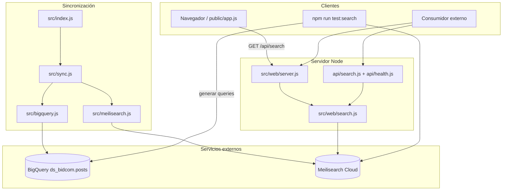

# Documentación del proyecto meilisearch-sync

Proyecto Node.js que sincroniza el catálogo de productos de **Bidcom** desde **BigQuery** hacia el índice **`productos-BQ`** de **Meilisearch Cloud**, con configuración de relevancia, orden web e imágenes. Incluye interfaz web de búsqueda, API HTTP y suite de tests de relevancia.

Pensado para el catálogo de Bidcom: tabla `posts` en `ds_bidcom`, productos publicados de WordPress replicados en BigQuery.

---

## 1. Propósito

El repositorio tiene cuatro capacidades principales:

| Componente | Comando / ruta | Para qué sirve |
|---|---|---|
| **Sincronización** | `npm run sync` | Carga y actualiza productos desde BigQuery en Meilisearch |
| **Settings del índice** | `npm run settings` | Aplica solo configuración de Meilisearch (sin reindexar) |
| **Interfaz web** | `npm run web` → `http://localhost:3000` | Buscador con pestañas Bidcom/Gadnic, categorías y productos |
| **API HTTP** | `GET /api/search`, `GET /api/health` | Backend reutilizable (local o Vercel) |
| **Tests de relevancia** | `npm run test:search` | Validar que ~308 búsquedas devuelven resultados correctos |

---

## 2. Arquitectura general



**Dependencias clave** (`package.json`):

- `meilisearch` — cliente oficial
- `@google-cloud/bigquery` — lectura del catálogo y generación de queries de test
- `dotenv` — variables de entorno
- Node.js **≥ 20**, módulos ES (`"type": "module"`)

---

## 3. Sincronización (BigQuery → Meilisearch)

### 3.1 Qué hace el sync

1. Lee productos publicados desde BigQuery (`post_status = 'publish'`).
2. Normaliza cada documento (IDs, fechas, `orden_web`, imágenes, `es_accesorio`, `es_ref_usa`).
3. Configura el índice de Meilisearch (searchable, displayed, ranking, sort, sinónimos).
4. Hace upsert por lotes.
5. Opcionalmente elimina documentos que ya no existen en la fuente.

### 3.2 Uso

```bash
# Sincronización completa (una vez)
npm run sync

# Mismo comando, alias
npm start

# Sincronización en loop cada N minutos
npm run sync:watch          # cada 10 minutos (hardcoded en package.json)
node src/index.js --interval 30
SYNC_INTERVAL_MINUTES=15 npm run sync
```

Tarda unos **4–6 minutos** para ~21.600 productos (lectura BigQuery + upsert en lotes). Muestra progreso por batch.

### 3.3 Entry point — `src/index.js`

- Carga configuración con `loadConfig()`.
- Sin argumentos: ejecuta **una sola** sincronización y termina.
- Con `--interval N` o `SYNC_INTERVAL_MINUTES`: modo **scheduler**:
  - Corre un sync inmediato al arrancar.
  - Repite cada N minutos.
  - Si un sync anterior sigue corriendo, salta el tick programado.
  - Responde a `SIGINT` / `SIGTERM` para detener el scheduler.

### 3.4 Orquestación — `src/sync.js`

Función principal: `syncIndex(config)`.

```
BigQuery (posts)
    │
    ▼
fetchRows() ──► normalizeDocument() ──► ensureIndex() (settings)
    │
    ▼
upsertDocuments() por lotes
    │
    ▼
deleteStaleDocuments() (opcional)
    │
    ▼
Índice productos-BQ en Meilisearch
```

Retorna un resumen:

```json
{
  "fetched": 21600,
  "upserted": 21600,
  "deleted": 12,
  "elapsedSeconds": 285.43
}
```

### 3.5 Normalización de documentos — `normalizeDocument()`

| Campo | Tratamiento |
|---|---|
| `ID` (primary key) | Convertido a `string` (BigQuery devuelve NUMERIC) |
| `orden_web` | Numérico; `null` o vacío → `9999` |
| `imagen_calada` | Si viene vacío, se extrae del JSON `fields` (URL `1000x1000` de bidcom.com.ar) |
| Fechas | ISO string (`toISOString()`) |
| NUMERIC de BQ | String entero (`toFixed(0)`) |
| `es_accesorio` | `1` si el título parece accesorio, `0` si no (heurística por prefijos y patrones) |
| `es_ref_usa` | `1` si `codigo_aguila` empieza con `ref-` o `usa-`, `0` si no |

#### Heurística de accesorios (`isAccessoryTitle`)

Marca como accesorio títulos que empiezan con: `kit`, `funda`, `soporte`, `porta`, `accesorio`, `repuesto`, etc.

También detecta patrones como `porta notebook`, `para celular`, `instalacion de`, etc.

Este campo alimenta la ranking rule `es_accesorio:asc` para que accesorios queden debajo de productos principales.

#### Heurística ref/usa (`isRefUsaSku`)

Marca como baja prioridad los SKU cuyo `codigo_aguila` empieza con `ref-` o `usa-` (case insensitive).

Alimenta `es_ref_usa:asc` en ranking rules. Es la **primera** regla: separa ref/usa del resto antes que relevancia, `orden_web` o accesorios.

#### Extracción de imagen (`extractImageFromFields`)

Busca URLs de imágenes en el campo `fields` (JSON crudo de WordPress):

- Patrón: `https://www.bidcom.com.ar/publicacionesML/productos/...jpg|png|webp`
- Prefiere la variante `1000x1000` si existe.

### 3.6 Cliente Meilisearch — `src/meilisearch.js`

| Función | Descripción |
|---|---|
| `createMeilisearchClient(config)` | Cliente con timeout de 5 min por tarea |
| `ensureIndex(client, config)` | Crea índice si no existe; aplica settings (searchable, displayed, filterable, ranking, sort, sinónimos) |
| `upsertDocuments(index, docs, pk, batchSize)` | `addDocuments` en lotes con progreso en consola |
| `deleteStaleDocuments(index, sourceIds, pk, batchSize)` | Escanea el índice y borra IDs que no están en BigQuery |

**Importante**: el sync solo actualiza searchable, displayed, filterable, ranking, sort y sinónimos. No configura embedder ni búsqueda semántica.

### 3.7 Cliente BigQuery — `src/bigquery.js`

```javascript
export async function fetchRows(config) {
  const client = new BigQuery({ projectId, credentials });
  const [job] = await client.createQueryJob({ query, location });
  const [rows] = await job.getQueryResults();
  return rows;
}
```

Query por defecto (si no se define `BIGQUERY_QUERY`):

```sql
SELECT * FROM `project.ds_bidcom.posts`
WHERE post_status = 'publish'
ORDER BY orden_web ASC
```

### 3.8 Variables de entorno del sync

| Variable | Requerida | Default | Descripción |
|---|---|---|---|
| `BIGQUERY_CREDENTIALS_JSON` | Sí | — | JSON completo de la service account |
| `BIGQUERY_DATASET` | Sí | — | Dataset (`ds_bidcom`) |
| `BIGQUERY_TABLE` | Sí | — | Tabla (`posts`) |
| `BIGQUERY_QUERY` | No | ver arriba | Query SQL custom |
| `BIGQUERY_LOCATION` | No | `US` | Región de ejecución |
| `MEILISEARCH_HOST` | Sí | — | URL de Meilisearch |
| `MEILISEARCH_API_KEY_SYNC` | Sí | — | API key con permisos de admin (sync, settings, tests) |
| `MEILISEARCH_INDEX` | Sí | — | Índice destino (`productos-BQ`) |
| `MEILISEARCH_PRIMARY_KEY` | No | `ID` | Campo ID en BigQuery y Meilisearch |
| `MEILISEARCH_SORT_FIELD` | No | `orden_web` | Campo de prioridad web |
| `MEILISEARCH_FILTERABLE_ATTRIBUTES` | No | `marca,categoria_principal_name` | Filtros y facets (web) |
| `SYNC_BATCH_SIZE` | No | `1000` | Documentos por lote |
| `SYNC_DELETE_STALE` | No | `true` | Borra docs que ya no están en BQ |
| `SYNC_INTERVAL_MINUTES` | No | — | Intervalo del scheduler |

### 3.9 Troubleshooting del sync

| Problema | Solución |
|---|---|
| Timeout en Meilisearch | Bajá `SYNC_BATCH_SIZE` (ej. `500`). El cliente usa timeout de 5 min por tarea. |
| Imágenes que no se ven | Meilisearch muestra `imagen_calada`. El sync la completa desde `fields` si viene vacía. Productos sin foto en ningún lado no tendrán imagen. |
| `displayedAttributes` tarda mucho | Actualizar displayed en ~21k docs puede tardar varios minutos. Es normal en Meilisearch. |
| Documentos pesados | ~7 KB c/u por el JSON `fields`. Considerar batch size menor si hay timeouts. |

---

## 4. Configuración del índice Meilisearch

Definida en `src/config.js`. El sync la aplica en cada ejecución; los tests también pueden re-aplicarla.

### 4.1 Searchable attributes (orden = prioridad)

```
post_title → categoria_principal_name → categoria_principal_slug → codigo_aguila →
ean → id_producto → subtitulo → descripcion_producto → marca → tags → linea →
post_name → titulo_texto_plano_ml
```

Override: `MEILISEARCH_SEARCHABLE_ATTRIBUTES` (lista separada por comas).

### 4.2 Displayed attributes

`post_title`, `imagen_calada`, `precio`, `precio_tachado`, `descuento`, `marca`, `codigo_aguila`, `ean`, `subtitulo`, `descripcion_producto`, categorías, `linea`, `tags`, `orden_web`, flags (`envio_gratis`, `mas_vendido`, `recomendado`), IDs, cuotas, `post_modified`, `es_accesorio`, `es_ref_usa`, etc.

Override: `MEILISEARCH_DISPLAYED_ATTRIBUTES`.

### 4.3 Ranking rules

```javascript
['es_ref_usa:asc', 'words', 'typo', 'proximity', 'attributeRank', 'wordPosition', 'sort', 'exactness', 'es_accesorio:asc']
```

1. `es_ref_usa:asc` separa primero: **todo** `es_ref_usa = 0` arriba de **todo** `es_ref_usa = 1` (más fuerte que relevancia y `orden_web`).
2. Luego gana la **relevancia textual** (palabras, typos, proximidad, posición en el título).
3. La regla **`sort`** aplica `orden_web` cuando la query usa `sort: ['orden_web:asc']`.
4. `exactness` favorece coincidencias exactas.
5. `es_accesorio:asc` empuja accesorios **después** de productos principales (solo entre no ref/usa).

> La prioridad comercial (`orden_web`) se aplica en **cada búsqueda** vía parámetro `sort`, no como ranking rule fija. La regla `sort` debe estar **antes de `exactness`** para que `orden_web` tenga efecto real entre resultados relevantes.

### 4.4 Sortable attributes

- `orden_web` — prioridad comercial (1 = más importante, 9999 = sin prioridad).
- `es_ref_usa` — separar SKU `ref-` / `usa-` al final.
- `es_accesorio` — separar accesorios de productos.

### 4.5 Filterable attributes (facets y filtros)

Por defecto: `marca`, `categoria_principal_name`.

Necesarios para:

- Pestaña **Gadnic** en la web (`filter: marca = "Gadnic"`).
- Chips de **categorías** (`facets` en la misma request de búsqueda).
- Filtro por categoría al hacer click en un chip.

Override: `MEILISEARCH_FILTERABLE_ATTRIBUTES` (lista separada por comas).

### 4.6 Sinónimos incorporados

| Término | Sinónimos |
|---|---|
| `lavarropas` | lavarropa |
| `notebooks` | notebook, laptop, portatil, portátil |
| `pendrive` | pen drive, memoria usb |
| `celulares` | celular, smartphone |
| `smartwatch` | smart watch |
| `tablets` | tablet |
| `drones` | drone |
| `parlantes` | parlante |
| `auriculares` | auricular |
| `impresoras` | impresora |
| `heladeras` | heladera |
| `microondas` | microonda |
| `cafeteras` | cafetera |
| `aspiradoras` | aspiradora |
| `masajeadores` | masajeador |
| `tabla grafica` | tableta grafica |
| `griferias` | griferia, canilla |
| `anafes` | anafe |
| `trapeadores` | trapeador, mopa |

### 4.7 Búsqueda semántica (embedder) — no activa

**Estado actual:** el índice `productos-BQ` usa solo **búsqueda por texto** (keywords, sinónimos, ranking rules, `sort`, filtros y facets). **No hay embedder configurado** ni búsqueda híbrida (`hybrid`) en la web ni en los tests.

**Por qué no lo usamos aún:** en Bidcom las búsquedas son en su mayoría términos cortos (`lavarropas`, `gadnic`, SKU, marca) y filtros por catálogo. La relevancia textual + `orden_web` + pestañas Bidcom/Gadnic cubre ese caso. La semántica aportaría más en consultas en lenguaje natural del estilo *"algo para inflar las ruedas del auto"*, que hoy no es el flujo principal.

**Si en el futuro se quisiera activar:** Meilisearch Cloud permite un embedder OpenAI en la UI (sin tocar el sync). Habría que:

1. Configurar el embedder en Meilisearch Cloud.
2. Usar `hybrid: { embedder: '…', semanticRatio: … }` en el frontend (la web actual **no** lo hace).
3. Asumir costo y latencia extra al indexar (~21k embeddings) y al buscar.

Template de referencia (solo si se reactiva):

```
Producto: {{ doc.post_title }}. SKU: {{ doc.codigo_aguila }}. Marca: {{ doc.marca }}. Categoría: {{ doc.categoria_principal_name }}. Línea: {{ doc.linea }}. EAN: {{ doc.ean }}. Descripción: {{ doc.descripcion_producto | truncatewords: 40 }}
```

---

## 5. Capa de búsqueda (`src/web/`)

### 5.1 Configuración web — `src/web/config.js`

Solo requiere variables de Meilisearch (no BigQuery).

| Variable | Requerida | Default | Uso |
|---|---|---|---|
| `MEILISEARCH_HOST` | Sí | — | URL de Meilisearch |
| `MEILISEARCH_API_KEY` | Sí | — | API key de búsqueda (solo lectura recomendada) |
| `MEILISEARCH_INDEX` | Sí | — | Nombre del índice |
| `MEILISEARCH_SORT_FIELD` | No | `orden_web` | Campo de sort en cada búsqueda |
| `SEARCH_WEB_PORT` | No | `3000` | Puerto del servidor local |

La marca Gadnic para filtrar está fija en código: `GADNIC_MARCA = 'Gadnic'` (no es env var).

### 5.2 Lógica de búsqueda — `src/web/search.js`

**Cliente cacheado**: una sola instancia de `MeiliSearch` por proceso.

#### `searchProducts(params)`

| Parámetro | Tipo | Default | Comportamiento |
|---|---|---|---|
| `q` | string | `""` | Query de búsqueda (trim) |
| `scope` | string | `bidcom` | `bidcom` = sin filtro de marca; `gadnic` = solo `marca = "Gadnic"` |
| `category` | string | — | Filtra por `categoria_principal_name` (click en chip) |
| `limit` | number | `20` | Máximo **50** |
| `offset` | number | `0` | Paginación |
| `scores` | `"1"` / `true` | off | Incluye `_rankingScore` en hits |

Siempre aplica `sort: ['orden_web:asc']` y pide **facets** de `categoria_principal_name` en la misma request.

Respuesta de ejemplo:

```json
{
  "query": "cargador",
  "scope": "gadnic",
  "category": null,
  "filter": "marca = \"Gadnic\"",
  "sort": ["orden_web:asc"],
  "processingTimeMs": 12,
  "estimatedTotalHits": 742,
  "categories": [
    { "name": "Cargadores Portátiles", "count": 129 },
    { "name": "Arrancadores de Batería", "count": 32 }
  ],
  "hits": []
}
```

#### `getHealthInfo()`

Devuelve `{ index, host }` para diagnóstico.

### 5.3 Aplicar settings sin sync — `npm run settings`

Ejecuta `src/apply-settings.js` → solo `ensureIndex()` (settings del índice, **sin** leer BigQuery ni reindexar).

Útil cuando cambiás ranking rules, filterable attributes o sinónimos y querés probar la web sin esperar un sync completo.

### 5.4 Servidor HTTP local — `src/web/server.js`

| Método | Ruta | Acción |
|---|---|---|
| `GET` | `/api/search` | Delega a `searchProducts` |
| `GET` | `/api/health` | Delega a `getHealthInfo` |
| `GET` | `/`, `/style.css`, `/app.js`, … | Archivos estáticos desde `public/` |

```bash
npm run web
# → http://localhost:3000
```

---

## 6. API serverless (Vercel) — carpeta `api/`

- **`api/search.js`** — `GET` con query params `q`, `scope`, `category`, `limit`, `offset`, `scores`. Otros métodos → `405`.
- **`api/health.js`** — `GET` con info del índice.

Ambos importan la lógica de `src/web/search.js`. La API key **no** se expone al navegador.

### Deploy en Vercel

1. Conectar el repo de GitHub en [vercel.com](https://vercel.com).
2. **Framework Preset:** Other. **Build Command** y **Output Directory** vacíos.
3. Variables de entorno (solo Meilisearch):

| Variable | Ejemplo |
|---|---|
| `MEILISEARCH_HOST` | `https://ms-….meilisearch.io` |
| `MEILISEARCH_API_KEY` | tu API key |
| `MEILISEARCH_INDEX` | `productos-BQ` |
| `MEILISEARCH_SORT_FIELD` | `orden_web` (opcional) |

4. Deploy. Vercel sirve `public/` como estático y `api/` como serverless.

No hace falta `vercel.json`. El **sync no corre en Vercel** (proceso largo con BigQuery); solo la web.

Después del primer deploy, si las pestañas o categorías fallan por filterable, corré `npm run settings` una vez contra el índice de producción (o un `npm run sync`).

---

## 7. Interfaz web — carpeta `public/`

### 7.1 `index.html`

- Pestañas **Bidcom** (catálogo completo, sin filtro) y **Gadnic** (`marca = "Gadnic"`).
- Barra de búsqueda, checkbox "Mostrar ranking score".
- Bloque de **categorías** (chips con conteo) y lista de productos.

### 7.2 `app.js`

1. Búsqueda con **debounce** (300 ms); mínimo 2 caracteres.
2. Llama a `GET /api/search?q=...&scope=bidcom|gadnic&limit=20` (y `category=...` si hay chip activo).
3. Renderiza chips de categorías desde `categories` (facets de Meilisearch).
4. Click en categoría → filtra productos; segundo click → quita filtro.
5. Renderiza imagen, título, badges (marca, categoría, `orden_web`, accesorio, score), precio en ARS, SKU/EAN/ID.
6. Escapa HTML (`escapeHtml`).

### 7.3 `style.css`

UI responsive con soporte light/dark (`prefers-color-scheme`).

---

## 8. Suite de tests de relevancia

### 8.1 Ejecución

```bash
npm run test:search
SKIP_SETTINGS=true npm run test:search
VERBOSE=true npm run test:search
```

Cada búsqueda usa `sort: ['orden_web:asc']`, igual que la web.

### 8.2 Composición — 308 queries

| Origen | Cantidad | Fuente |
|---|---|---|
| Manual | 100 | `src/manual-queries.js` |
| Generadas | 200 | BigQuery: categorías, marcas, líneas |
| ref_usa | 8 | `src/ref-usa-queries.js` |

### 8.3 Criterio de éxito

**Manual y generadas:** el **primer resultado** debe coincidir con el patrón esperado (y categoría/marca según el modo).

**ref_usa:** si en la primera página hay SKU con `es_ref_usa = 0`, el #1 no puede ser `es_ref_usa = 1`, y ningún ref/usa puede aparecer antes que un normal en el ranking.

Hints de fallo: `ranking`, `ref_usa`, `accesorio`, `catalogo`.

---

## 9. Estructura de archivos

```
meilisearch-sync/
├── api/
│   ├── search.js
│   └── health.js
├── docs/
│   └── DOCUMENTACION.md
├── public/
│   ├── index.html
│   ├── app.js
│   └── style.css
├── src/
│   ├── index.js           # Entry point del sync + scheduler
│   ├── apply-settings.js  # Solo settings de Meilisearch (npm run settings)
│   ├── config.js          # Env vars y defaults del índice
│   ├── bigquery.js        # Lectura desde BigQuery
│   ├── meilisearch.js     # Cliente, settings, upsert, delete stale
│   ├── sync.js            # Orquestación y normalización
│   ├── manual-queries.js  # 100 búsquedas manuales de prueba
│   ├── test-queries.js    # Generador de 200 búsquedas desde catálogo
│   ├── test-search.js     # Runner de tests de relevancia
│   └── web/
│       ├── config.js      # Config web + filtros scope/categoría
│       ├── search.js      # searchProducts() compartido local/Vercel
│       └── server.js      # Servidor HTTP local
├── .env.example
└── package.json
```

---

## 10. Campos de producto relevantes

| Campo | Rol |
|---|---|
| `post_title` | Título principal, mayor peso searchable |
| `codigo_aguila` | SKU interno |
| `ean` | Código de barras |
| `marca` / `linea` | Relevancia y badges |
| `categoria_principal_name` | Categoría + validación en tests |
| `orden_web` | Prioridad comercial (sort) |
| `es_accesorio` | Ranking + badge; calculado en sync |
| `es_ref_usa` | Ranking + badge; `1` si SKU empieza con `ref-` o `usa-` |
| `imagen_calada` | Thumbnail; completada en sync desde `fields` |
| `precio`, `precio_tachado`, `descuento` | Precio en UI |
| `ID` | Primary key del documento |
| `fields` | JSON crudo de WordPress (solo en BQ/sync, no displayed) |

---

## 11. Troubleshooting general

| Problema | Qué revisar |
|---|---|
| Sync lento o timeout | `SYNC_BATCH_SIZE`, tamaño de docs (~7 KB) |
| Accesorios arriba del producto | `es_accesorio:asc` + sort `orden_web`; correr `npm run test:search` |
| SKU ref-/usa- arriba del principal | `es_ref_usa:asc` debe ser la **primera** ranking rule; correr `npm run settings` |
| Imágenes faltantes | Campo `fields` en BQ; heurística `extractImageFromFields` |
| API 500 "marca is not filterable" | Correr `npm run settings` o `npm run sync` para aplicar filterable attributes |
| Pestañas / categorías vacías | Mismo: `marca` y `categoria_principal_name` deben ser filterable |
| API 500 "Missing env…" | Variables `MEILISEARCH_*` en `.env` o Vercel |
| Tests fallan | Ver hints: `ranking`, `ref_usa`, `accesorio`, `catalogo` |

---

## 12. Comandos rápidos

```bash
npm install
cp .env.example .env

npm run sync           # sincronización completa
npm run sync:watch     # sync cada 10 min
npm run settings       # solo settings del índice (rápido)
npm run web            # UI + API local en :3000
npm run test:search    # 308 tests de relevancia
```

---

## 13. Requisitos

- Node.js **20+**
- Service account de GCP con acceso de lectura a BigQuery
- Instancia de Meilisearch (Cloud o self-hosted) con API key

---

Proyecto privado — uso interno Bidcom.
